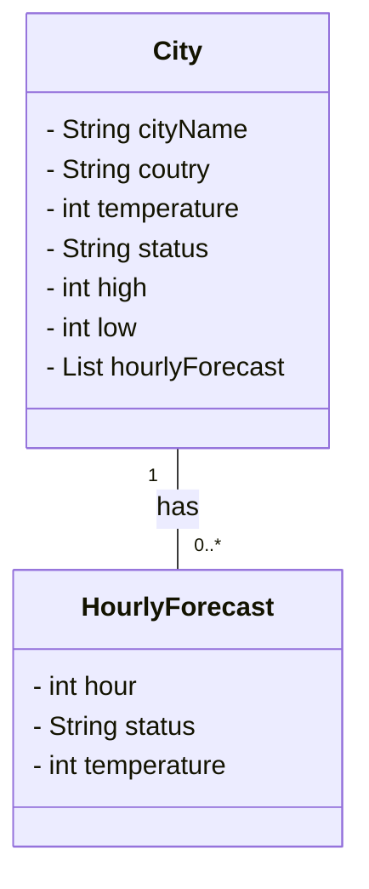

# desafio-dio-rest
 desafio dio rest 
## Diagrama de classes

```mermaid

classDiagram
    class City {
        - String cityName
        - String coutry
        - int temperature
        - String status
        - int high
        - int low
        - List<HourlyForecast> hourlyForecast
    }

    class HourlyForecast {
        - int hour
        - String status
        - int temperature
    }

    City "1" -- "0..*" HourlyForecast : has

```
